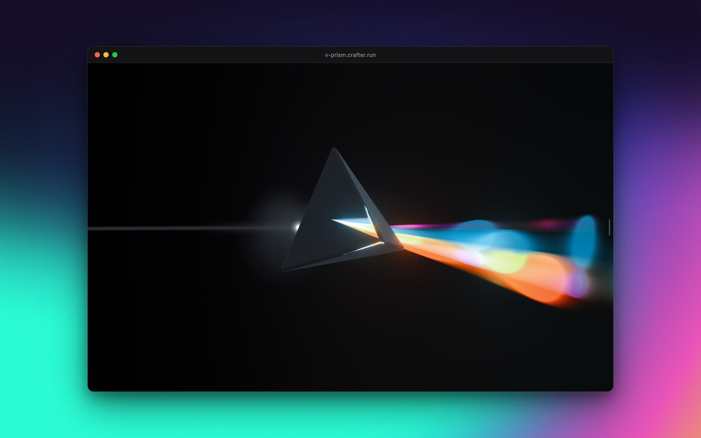

# v-prism



A glass prism that splits a beam of light into an animated rainbow, rendered on WebGPU with
[vgpu](https://vgpu.sh) as the only rendering dependency. Live at
[v-prism.crafter.run](https://v-prism.crafter.run).

It rebuilds the three.js scene at [v-prism.vercel.app](https://v-prism.vercel.app) with Next.js 16
(App Router, Turbopack), TypeScript and WGSL. No three.js, no other GPU library: `npm ls three`
reports nothing.

Click or drag to aim a light beam at a glass tetrahedron; it disperses into an animated rainbow.

| Input | Does |
| --- | --- |
| Click / drag, one finger | Aim the beam |
| Scroll | Tilt and turn the glass |
| ⌥ + scroll | Spin it in the screen plane |
| Pinch, ⌘/Ctrl + scroll | Zoom (0.4x to 4x) |
| Two fingers on touch | Drag to tilt/turn, twist to spin, pinch to zoom |
| Handle on the right edge | Opens the drawer: presets, light, glass, motion, zoom, reset |

```bash
npm install
npm run dev
npm run build && npm start
```

Needs a browser with WebGPU: current Chrome, Edge and Safari 26 on desktop, Safari on iOS 26,
Chrome on Android 12+, Firefox 141+ on Windows. Without it the page shows a still frame from the
renderer and says why: the browser has no WebGPU, WebGPU is switched off for the GPU, the page is
not a secure origin, or the renderer hit an error (shown as is).

WebGPU only exists on secure origins, so a phone opening the dev server by LAN IP
(`http://192.168.x.x:3000`) never gets it. Test phones on a deployment instead: every push gets
an HTTPS preview URL.

## How it renders

Everything is a `draw()` or `effect()` from vgpu, encoded into one `frame()` per tick:

| Pass | Target | Draws |
| --- | --- | --- |
| Scene | `scene` (rgba16float) | background clear, up to two rainbow quads (premultiplied); this is what the glass refracts |
| Glass | `lit` (rgba16float, 4x MSAA) | copy of `scene`, beam sprites and lens flare (additive), then the glass, which covers them |
| Bloom | 9 half-res levels | `smoothstep(1, 2, luminance)` threshold, 13-tap downsample chain, tent upsample mixed at 0.85 per level |
| Present | canvas | `lit` + bloom, clipped, through the F-6800 film LUT (a 33³ `texture_3d`), to sRGB |

The glass shader refracts the beam plane into the `scene` texture in screen space (Snell through
the glass thickness, three wavelengths for a hint of dispersion, a jittered disk for roughness),
reflects a procedural studio evaluated analytically per direction (a gradient dome plus soft
panels; the light preset uses the original three softboxes), and mixes them with a dielectric
Fresnel plus a clearcoat term. There is no tone mapping, which is what the original pipeline did:
it clipped, applied the LUT, and encoded to sRGB.

Glare matches the original lens-flare textures without shipping them: `shaders/glare.wgsl`
holds each texture's measured brightness curve (radial for the glows and flare dots, along and
across for the streak), and every sprite quad is cropped to where its curve is non-zero, so
nothing ever ends in a visible square. Glare lives in the lens, not the scene, so the flare and
the beam's glint and width keep their on-screen size at any zoom; like the original, the glass
hides whatever glare falls behind it.

The camera is an orthographic, pixel-space camera sized in CSS pixels (50 / 70 / 100 px per
world unit by breakpoint, times the zoom); render targets follow the device pixel size, so a
2x display renders at 2x without changing the framing. On resize every offscreen target is
resized in place with vgpu's `target.resize()`; bindings made with the target follow
automatically, so nothing is ever destroyed or rebound mid-flight.

Every pipeline is compiled at load against the exact target it draws into (format and sample
count), as vgpu recommends, so a GPU that rejects one fails before the first frame and lands on
the fallback with the pass name and the GPU's own message. The shaders avoid pipeline-overridable
constants: Safari 26 cannot build the vertex function of a module compiled with one set
(`Vertex library failed creation`), so the beam's line mode is a uniform instead.

Rendering is on demand. The frame loop stops when nothing is animating; the idle drift keeps it
alive by default, and `prefers-reduced-motion` turns the drift off.

## Layout

```
src/app/                    Next.js shell: layout, page, global styles
src/prism/index.tsx         client component: canvas, pointer overlay, hint, drawer
src/prism/simulation.ts     per-tick state: aim, hit, rotation + drift, rainbow beams, fades
src/prism/render/renderer.ts  vgpu context, surface, frame scheduling, resize, uniform writes
src/prism/render/passes/    one WGSL file per pass and the TypeScript that binds it
src/prism/render/shaders/   shared WGSL modules: studio environment, spectrum, glare curves
src/prism/render/targets.ts render targets and the bloom chain
src/prism/render/lut.ts     KTX2 reader for the film LUT
src/prism/render/support.ts why WebGPU is unavailable, when it is
src/prism/geometry/         rounded regular tetrahedron, its 24 symmetries, screen-space outline
src/prism/optics/           symmetric rainbow optics (the original formula in prism space), drift
src/prism/math/             vec3, quat, mat4, angles, 2D convex hull
src/prism/state/            small store + settings and prism state (used by React and the renderer)
src/prism/ui/               drawer, hint, GitHub link, still-frame fallback
src/prism/pointer.ts        aim and rotate gestures
```

Shaders are validated with `npx vgpu check src/prism/render/passes/<pass>.wgsl`. Visual checks
use [agent-browser](https://github.com/vercel-labs/agent-browser) with real WebGPU:

```bash
agent-browser --session prism --webgpu open http://localhost:3000
agent-browser --session prism --webgpu set viewport 1440 900 2
agent-browser --session prism --webgpu reload && agent-browser --session prism --webgpu wait 6000
agent-browser --session prism --webgpu screenshot prism.png
agent-browser --session prism --webgpu errors
```

## Credits

The pmndrs [`nextjs-prism`](https://github.com/pmndrs/examples/tree/main/examples/nextjs-prism)
example (MIT) for the concept and the film LUT, AlanZucconi's spectral rainbow and JuliaPoo's
iridescence for the rainbow shader. The screenshot sits on Raycast's Red Distortion wallpaper.
